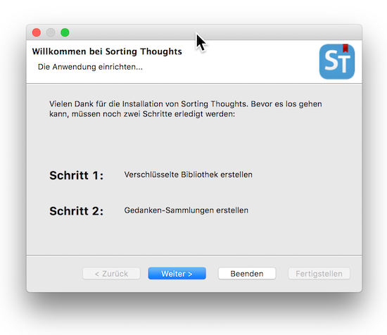

   [◀️ Installation](../installation.md)

  [Grundlagen ▶️](grundlagen.md) 

  

---------------
__Inhalt__
* TOC
{:toc}
---------------

## Gedanken-Bibliothek und Gedanken-Sammlung

Alle Gedanken, die man mit Sorting Thoughts erfassen kann, werden in einer Gedanken-Sammlung abgelegt. Eine Gedanken-Sammlung wird wiederum in einer Gedanken-Bibliothek abgelegt. Technisch gesehen ist eine Gedanken-Bibliothek eine verschlüsselte Datenbank auf die man nur Zugriff erhält, wenn man die korrekten Anmeldedaten hat. In der mobilen Version von Sorting Thoughts für iOS wird die Gedanken-Bibliothek automatisch erstellt und ist mit den Standard Sicherheitsfunktion der Datensicherheitsklassen "Vollständiger Schutz" von iOS verschlüsselt, siehe auch: [iOS Sicherheit (PDF)](https://images.apple.com/de/business/docs/iOS_Security_Guide.pdf)

### Gedanken-Bibliothek erstellen

Nach dem ersten Start der Desktop Version erscheint die Aufforderung einen Gedanken-Bibliothek und Gedanken-Sammlung anzulegen. Dazu muss man ein Verzeichnis angeben, wo die Gedanken-Bibliothek gespeichert werden soll. Außerdem muss man der Gedanken-Sammlung einen Namen geben und ein Benutzername und Passwort wählen. Die Anmeldedaten sind sehr wichtig, da nur damit der Zugriff erfolgen kann. Sollten die Anmeldedaten einmal vergessen werden, kann niemand mehr auf die Daten zugreifen.  

-----

**ACHTUNG:**
Anmeldedaten bitte merken! Es gibt keine Passwort-Erinnerungsfunktion - nur Sie kennen das Passwort!

-----

### Gedanken-Sammlung verwalten

Über den Menüpunkt **Sammlungen**:

kann man weitere Informationen über die aktuelle Sammlung abrufen:

oder die Sammlung wechseln bzw. sperren, damit wieder eine Passwortabfrage beim nächsten Öffnen erforderlich wird.

In den Einstellungen für die Gedanken-Sammlungen lassen sich weitere Sammlungen erstellen, Sammlungen löschen oder sperren. Außerdem kann man hier die Sammlung für den Sync Service aktivieren.

### Import alter Gedanken-Sammlungen vor Version 2.0

Um Gedanken-Sammlungen vor Version 2.0 von Sorting Thoughts zu importieren, muss in den Einstellungen für die Gedanken-Sammlungen die Funktion "Vorgänger Import (v1.x)" genutzt werden. Nach Auswahl der  *.h2.db Datei der alten Sammlung und Eingabe von Benutzername sowie Passwort wird der Import durchgeführt und die Sammlung erscheint danach in der Sammlungsauflistung.

### Automatische Anmeldung ohne Passwort

Jede Gedanken Sammlung wird wie oben beschrieben mit einem Passwortschutz versehen. Es ist jedoch möglich die Gedanken-Sammlung ohne Passworteingabe zu öffnen, wenn man diese nicht gesperrt hat. In diesem Fall wird beim Start nur das Passwort der Gedanken-Bibliothek abgefragt. Möchte man auch diese Passwortabfrage nicht, kann man die Automatische Anmeldung in den Einstellungen für die Gedanken-Sammlungen aktiviert. Dies ist nur zu empfehlen, wenn man in den Computer alleine nutzt bzw. keine schützenswerten Gedanken speichert.

### Automatisches Backup erstellen

Die Desktop Version verfügt über eine automatische Backupfunktion, die die gesamte Gedanken-Bibliothek bzw. die Datenbank nach dem Beenden als ZIP Datei zusammenpackt und speichert. Es lässt sich außerdem einstellen wieviele Backup-Dateien bis zum nächsten Überschreiben bestehen bleiben sollen - maximal sind 10 Sicherungszyklen möglich.

---------------

   [◀️ Installation](../installation.md)

  [Grundlagen ▶️](grundlagen.md)

