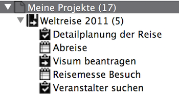
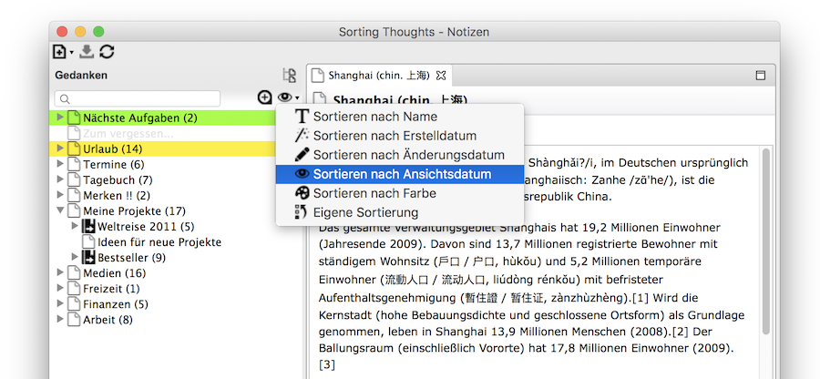
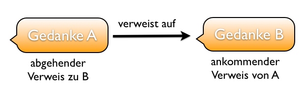
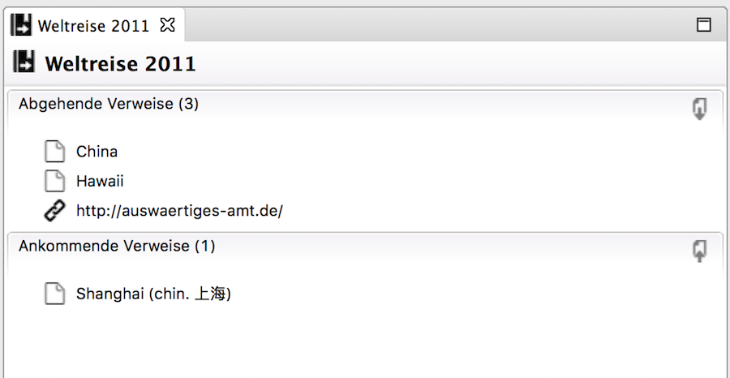
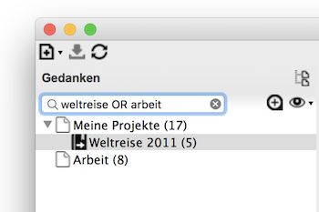
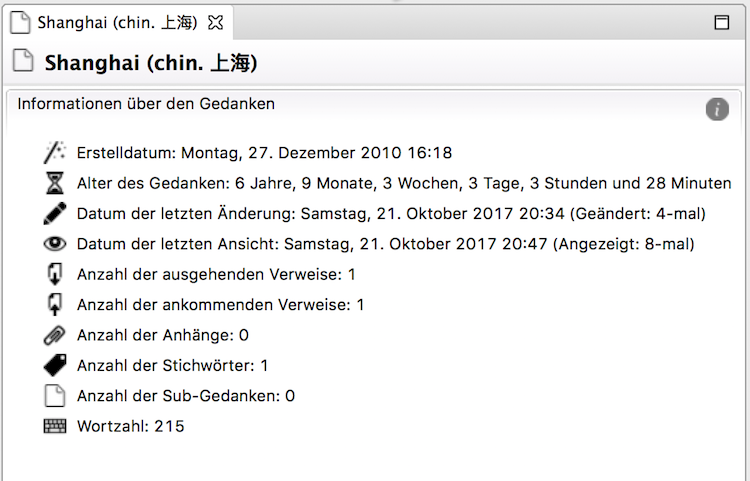
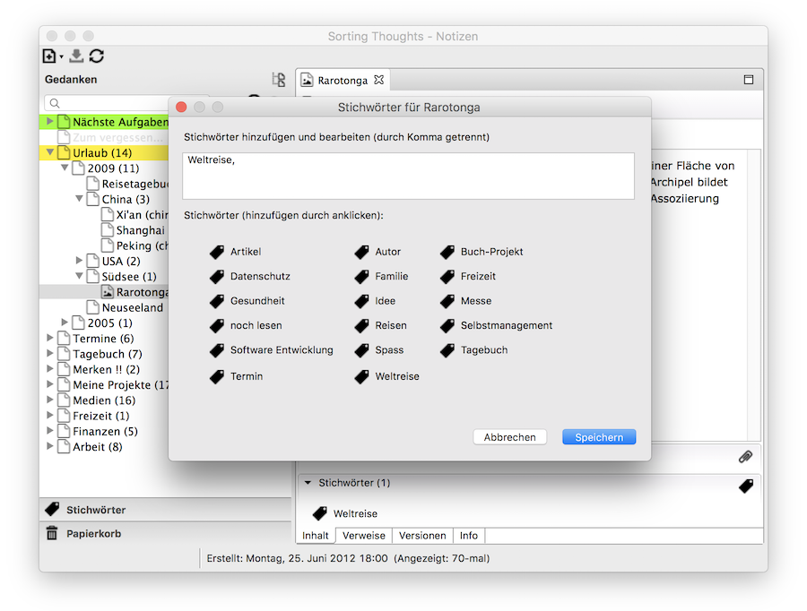
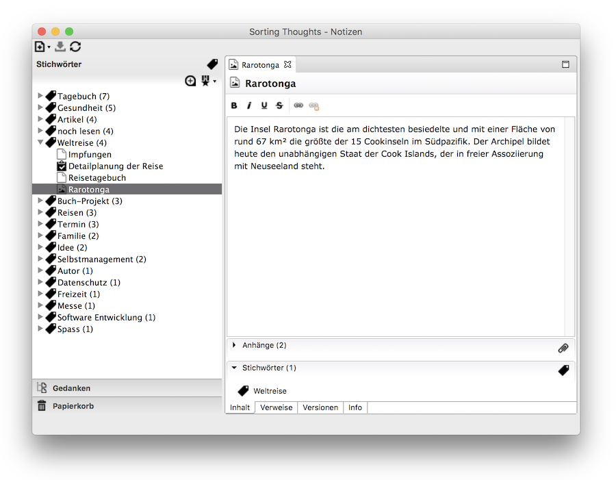

   [◀️ Grundlagen](grundlagen_desktop.md)

  [Projekte / Aufgaben ▶️](projekte_und_aufgaben.md)

---------------
__Inhalt__
* TOC
{:toc}
---------------

## Gedanken verwalten in der Desktop Version

### Strukturieren

Der Gedanken-Baum von Sorting Thoughts ermöglicht es Gedanken strukturiert abzulegen. So ist es möglich Sub-Gedanken anzulegen, um eine Beziehungen zum Eltern-Gedanken herzustellen. Dies ist z.B. sinnvoll, um Aufgaben einem Projekt zuzuordnen, wie die folgende Abbildung zeigt:

Der Gedanken-Baum ist zudem sehr flexibel und erlaubt es Gedanken frei zu verschieben, umso jederzeit Ein- bzw. Umordnungen vornehmen zu können. Siehe dazu auch [Gedanke verschieben](https://sortingthoughts.github.io/st-dokumentation/handbuch/grundlagen_desktop.html#gedanke-verschieben).

### Sortieren

Die Einträge im Gedanken-Baum können nach folgenden Kriterien sortiert werden:

* Nach Name (A bis Z)
* Nach Erstelldatum (jüngster Gedanke ist oben)
* Nach Änderungsdatum (zuletzt geänderter Gedanke ist oben)
* Nach Ansichtsdatum (zuletzt betrachteter Gedanke ist oben)
* Nach Farbe
* Eigene Sortierung (Gedanken haben die selbstgewählte Position)

Die Sortierung gilt immer für eine Ebene im Baum, d.h. Sub-Gedanken werden losgelöst von den darüber liegenden Gedanken sortiert also nur in ihrem Zweig bzw. Ebene.

### Verlinken

Gedanken können innerhalb des Editors beliebig mit anderen Gedanken und Internetseite verlinkt werden.

#### Verweise erstellen

**Interne Verweise erstellen**

Verweise zwischen Gedanken können einfach per Tastenkombination angelegt werden. Dazu die Anfangsbuchstaben eines Gedanken in den Editor tippen und anschließend Strg + Leertaste bzw. unter Mac OS X Control + Leertaste drücken und den Gedanken für den Verweis auswählen. Ein Verweis kann auch über den Verweisdialog angelegt werden

**Externe Verweise erstellen**

Um auf eine Webseite zu verweisen, reicht es die jeweilige URL in den Editor einzugeben. Falls ein anderer Verweisname verwendet werden soll, kann der Verweis auch über den Verweisdialog angelegt werde.

#### Verweise aufrufen
Jeder Verweise kann durch halten der Strg Taste bzw. der Command Taste (Mac OS X) und anschließendes anklicken aufgerufen werden.

#### Ankommenden und abgehenden Verweisen
Es gibt zwei unterschiedliche Sichtweisen auf Verweise. Die nachfolgende Abbildung verdeutlicht dies. Gedanke A verweist auf B. Der Verweis ist aus Sicht von Gedanke A abgehend und aus Sicht von B ankommend.

Allen ankommenden und abgehenden Verweise eines Gedanken sind zusammenfassend auf dem Karteireiter "Verweise" dargestellt. Durch Doppelklick können Verweise dort aufgerufen werden.

### Suchen und Filtern

#### Textsuche

Die Sucheingabe über dem Gedanken-Baum ermöglicht das schnelle Auffinden von Gedanken. Einfach das Suchwort eintippen und die Entertaste drücken. Im Gedanken-Baum werden dann alle Suchtreffer sichtbar. Die Suche berücksichtigt sowohl den Gedankennamen als auch den Inhalt des Gedanken. Durch Löschen des Suchwortes in der Sucheingabe werden wieder alle Gedanken sichtbar.
Durch die Verwendung von folgenden Suchoptionen kann die Suche sehr flexibel gestaltet werden:

| Suchoption | Beschreibung | Beispiel |
|:--------|:-------:|:-------:|
| Platzhalter oder so genannte Wildcards | Um einen Platzhalter für ein einzelnes Zeichen anzugeben, wird ein "?" benutzt. Um ein Platzhalter für mehrere Zeichen anzugeben, wird ein "*" benutzt.    Hinweis: Beide Platzhalter können sowohl innerhalb, als auch am Ende des Suchwortes stehen, jedoch nicht am Anfang.| **te?t**  würde nach allen Wörtern wie "test" oder "text" suchen.   **test***  würde nach allen Wörtern wie "test" oder "tester" suchen. |
| Wortgruppen | Wortgruppen können durch das Umschliessen von Anführungszeichen gesucht werden. | **"test text"**   sucht nur nach Einträgen, die als Gruppe die Wörter "test" und "text" enthalten. |
| logische Verknüpfungen | Logische Verknüpfungen können mit Hilfe der Operatoren AND und OR vorgenommen werden. Die OR Verknüpfung wird standardmäßig vorgenommen, man muss sie nicht explizit schreiben.    Es ist auch möglich durch den NOT Operator Suchwörter auszuschliessen. | **test AND text**   sucht alle Einträge, die sowohl das Wort "test" und "text" enthalten.    **test OR text** bzw. **test text**  sucht alle Einträge, die "test" oder "text" enthalten.    **test NOT text**   sucht nur nach Einträgen, die "test" enthalten, aber nicht das Wort "text" |
| Felder | Um nur in Gedankennamen zu suchen, kann man das Präfix "THOUGHT_TITLE:" vor das Suchwort stellen. | **THOUGHT_TITLE:test**   sucht nur nach Einträgen, die das Wort "test" im Namen enthalten. |

#### Filter

Neben der Suche gibt es auch Filterfunktionen mit denen es möglich ist, einen schnellen Überblick über bestimmt Gedanken-Typen zu erhalten. Die Filter sind per Rechtsklick auf das Sucheingabefeld erreichbar. Wie das nachfolgenden Bildschirmfoto zeigt gibt es folgende Filter:

| Filter | Suchwort für Schnellzugriff * |
|:--------|:-------:|
| Nächste Aufgaben - zeigt alle fälligen Aufgaben, sortiert nach Priorität und Ende-Datum	| mnA |
| Aufgaben (Büro, Privat, Sonstige, Alle)	| mbA, mpA, msA, mA |
| Projekte (Büro, Privat, Sonstige, Alle)	| mbP, mpP, msP, mP |
| Ereignisse	| mE |

\*) das Suchwort mnA steht zum Bsp. für "**m**eine **n**ächsten **A**ufgaben" und mbP für "**m**eine **b**üro **P**rojekte"

Wie bei der Suche, sind die übergeordneten Gedanken Teil der Ergebnismenge, um den Gedanken-Kontext zu erhalten.

### Metadaten

Jeder Gedanke verfügt über so genannte Metadaten, die weitere Information über den Gedanken bereitstellen. So ist z.B. über den Info Karteireiter ersichtlich wie alt ein Gedanke ist, wann er das letzte mal geändert wurde oder wie viele Wörter er enthält. Projekte und Aufgaben haben zusätzlich noch weitere Metadaten, die u.a. Informationen über die Statusänderungen beinhalten - siehe auch Spezielle Gedanken.

Metadaten:
* Erstelldatum
* Alter des Gedanken
* Datum der letzten Änderung
* Datum der letzten Ansicht
* Datum der letzten Synchronisierung (siehe auch HP webOS und Android Sync)
* Anzahl der ausgehenden und ankommenden Verweise
* Anzahl der Stichwörter
* Anzahl der Sub-Gedanken
* Wortzahl

### Stichwörter

#### Stichwörter vergeben

Falls die starre hierarchische Baumstruktur für Gedanken nicht ausreicht, um Gedanken zu ordnen, ist es zusätzlich möglich Gedanken mit Stichwörtern bzw. Tags zu versehen. Einem Stichwort können beliebig viele Gedanken zu geordnet werden und ein Gedanke kann auch beliebig viele Stichwörter haben.
Um ein Gedanken mit Stichwörtern zu versehen, muss der Stichwörter Dialog aus dem gleichnamigen Bereich geöffnet werden. Dort kann man Stichwörter frei definieren oder bestehende Stichwörter auswählen Mehrere Stichwörter sind einfach durch Komma zu trennen.

Übrigens falls ein Stichwort nicht mehr benutzt wird, verschwindet es aus der Stichwortliste.

#### Navigation per Stichwort

Alle Stichwörter werden in einer extra Stichwörter-Ansicht aufgelistet und lassen sich dort nach Verwendung und Namen sortieren. So ist es möglich einen schnellen Überblick über alle Stichwörter zu bekommen und Gedanken aus dieser Ansicht heraus zu öffnen.
Aus dem Stichwörter-Bereich unterhalb eines Gedanken kann ebenfalls direkt zur Stichwörter-Ansicht gesprungen werden. Dazu einfach auf das jeweilige Stichwort doppelklicken. So kann man schnell alle anderen Gedanken sehen, die auch dieses Stichwort besitzen.

#### Anwendung für Projekte und Aufgaben

Stichwörter sind besonders nützlich für Projekte und Aufgaben, da so weitere Ordnungskriterien sehr leicht hinzugefügt und gepflegt werden können. Ein Projekt oder eine Aufgabe kann z.B. an einem bestimmten Ort oder für einen bestimmten Kunden oder zu einer bestimmten Zeit stattfinden. Folgenden Stichwörtern können so beispielsweise für mehr Übersicht sorgen:

| Ordnungskriterium | Stichwort Beispiele |
|:--------|:-------:|
| Ort	|  @Berlin, @Dubai |
| Person| KundeMaier, Max Mustermann|
| Zeit	| 0-Täglich, 1-Jetzt, 2-Nächstes, 3-Bald, 4-Später, 5-Irgendwann, 6-Aufgeschoben|
| Was	|  Aktives Projekt, Inaktives Projekt, Idee, Forschungsprojekt|
| Bewertung	| Erfolgreiches Projekt, Desaster Projekt|
| Kontext	| Produktname, Technologiename, Überprojekt, Budget |

---------------

   [◀️ Grundlagen](grundlagen_desktop.md)

  [Projekte / Aufgaben ▶️](projekte_und_aufgaben.md)

