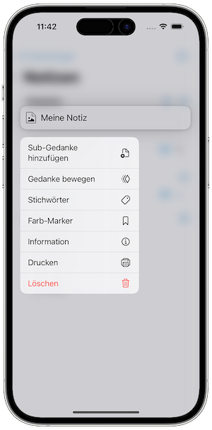

   [◀️ Grundlagen](grundlagen_mobile.md)

  [Projekte / Aufgaben ▶️](projekte_und_aufgaben.md)

---------------
__Inhalt__
* TOC
{:toc}
---------------

## Gedanken verwalten in der Mobile Version

### Strukturiere Gedanken

Das Gedanken-Kontextmenü ermöglicht es, die Gedanken zu strukturieren. Verwende die Funktion **Sub-Gedanke hinzufügen**, um einen Untergedanken zu erstellen. Der Untergedanke wird als Kind-Gedanke des ausgewählten Gedankens angezeigt. Der folgende Screenshot zeigt das Gedanken-Kontextmenü:

Die Anzahl der Untergedanken eines Gedankens wird in der Gedankenliste angezeigt. Der folgende Screenshot zeigt die Gedankenliste mit mehreren Untergedanken:

Du kannst auch einen Gedanken zu einem anderen übergeordneten Gedanken verschieben. Öffne dazu das Gedanken-Kontextmenü des Gedankens, den du verschieben möchtest, und wähle dann die Funktion **Gedanke bewegen** aus. Der folgende Screenshot zeigt die Ansicht zum Gedanken bewegen:

### Sortiere Gedanken

In der Gedankenliste kann man über folgendes Symbol die Sortierung der List ändern:

Damit lässt sich die Gedanken-Liste nach:

* Name
* Erstelldatum
* Änderungsdatum
* Ansichtsdatum
* Farbe

sortieren.

Das folgende Bild zeigt die Sortierkriterien:

### Filter Gedanken

Die Gedanken-Liste kann auch gefiltert werden, dazu einfach auf folgendes Symbol tippen:

Damit stehen folgende Filter zur Verfügung:

* Alle Gedanken
* Projekte
* Aufgaben
* Nächste Aufgaben (zeigt alle nicht abgeschlossen Aufgaben, dringende zu erst)
* Ereignisse

Das folgende Bild zeigt die Filterkriterien:

### Metadaten zu einem Gedanken

Über das Gedanken-Kontextmenü lassen sich mit der **Informationen** Funktion, weitere Metadaten zu dem ausgewählten Gedanken anzeigen:

### Stichwörter vergeben

Jeder Gedanken kann beliebig viele Stichwörter erhalten, um das Auffinden zu erleichtern. Stichwörter lassen sich über das Gedanken-Kontextmenü und der **Stichwörter** Funktion vergeben. Existierende Stichwörter der Gedanken-Sammlung werden in der Stichwörteransicht aufgelistet und können einfach ausgewählt werden. Über das obere Eingabefeld und das Plussymbol lassen sich neue Stichwörter vergeben:

Die Gedanken-Liste zeigt alle Stichwörter und ihre verknüpften Gedanken an:

Die Auflistung der Stichwörter lässt sich ebenfalls sortieren nach:

* Name
* Anzahl der Verwendung

---------------

   [◀️ Grundlagen](grundlagen_mobile.md)

  [Projekte / Aufgaben ▶️](projekte_und_aufgaben.md)

