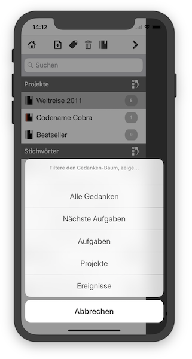

   [◀️ Grundlagen](grundlagen_mobile.md)

  [Projekte / Aufgaben ▶️](projekte_und_aufgaben.md)

---------------
__Inhalt__
* TOC
{:toc}
---------------

## Gedanken verwalten in der Mobile Version

### Strukturieren

In der mobilen Version von Sorting Thoughts wird der Gedanken-Baum geteilt angezeigt, d.h. alle Top- bzw. Elterngedanken werden in Gedanken-Liste angezeigt und alle zugehörigen Sub- bzw. Kinder-Gedanken werden separat auf einer extra Ansicht aufgelistet. Die Gedanken-Liste zeigt die Anzahl der Sub-Gedanken jedes Top-Gedanken mit an:

Im folgenden sieht man alle Sub-Gedanken von "Meine Projekte":

In dieser Ansicht lässt sich auch ein neuer Top-Gedanken zuweisen womit der Gedanke "Meine Projekt" dann ein Sub-Gedanken würde. Außerdem kann in der Sub-Gedanken Ansicht navigiert werden und die Sub-Gedanken von Sub-Gedanken aufrufen. In der folgenden Ansicht sieht man die Sub-Gedanken von dem "Weltreise 2011" Gedanken:

### Sortieren

In der Gedanken-Liste kann man über folgendes Symbol die Sortierung der List ändern:

Damit lässt sich die Gedanken-Liste nach:

* Name
* Erstelldatum
* Änderungsdatum
* Ansichtsdatum
* Farbe

sortieren.

### Filtern

Die Gedanken-Liste kann auch gefiltert werden, dazu einfach auf folgendes Symbol tippen:

Damit stehen folgende Filter zur Verfügung:

* Alle Gedanken-Liste
* Nächste Aufgaben (zeigt alle nicht abgeschlossen Aufgaben, dringende zu erst)
* Aufgaben
* Projekte
* Ereignisse

### Metadaten

Über den Dreipunkte-Aktionsknopf und "Informationen" lassen sich Metadaten zu dem ausgewählten Gedanken anzeigen:

### Stichwörter

Jeder Gedanken kann beliebig viele Stichwörter erhalten, um das Auffinden zu erleichtern. Stichwörter lassen sich über den Dreipunkte-Aktionsknopf und "Stichwörter" vergeben. Existierende Stichwörter der Gedanken-Sammlung werden in der Stichwörteransicht aufgelistet und können einfach ausgewählt werden. Über das obere Eingabefeld und das Plussymbol lassen sich neue Stichwörter vergeben:

Die Gedanken-Liste zeigt alle Stichwörter und ihre verknüpften Gedanken an:

Die Auflistung der Stichwörter lässt sich ebenfalls sortieren nach:

* Name
* Anzahl der Verwendung

---------------

   [◀️ Grundlagen](grundlagen_mobile.md)

  [Projekte / Aufgaben ▶️](projekte_und_aufgaben.md)

