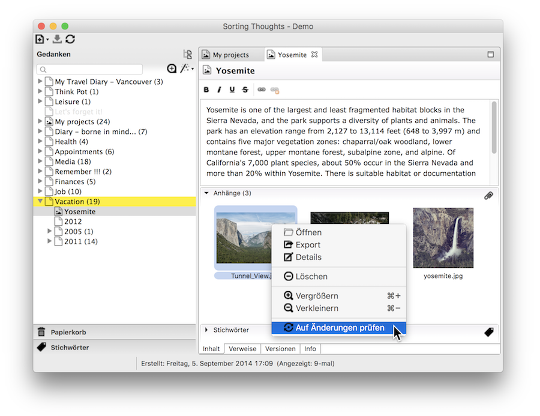

   [◀️ Gedanken-Bibliothek](gedanken_bibliothek.md)

  [Gedanken verwalten ▶️](gedanken_verwalten_desktop.md)

---------------
__Inhalt__
* TOC
{:toc}
---------------

## Grundlagen Desktop-Version

Die folgende Abbildung zeigt die Hauptelement von Sorting Thoughts:

### Gedanke anlegen

Ein Gedanke kann über das Menü oder durch Drücken der Tastenkombination Strg+N bzw. unter macOS Command+N erstellt werden.

Folgende Gedanken-Typen können angelegt werden (siehe Spezielle Gedanken):
- Einfacher Gedanke
- Projekt Gedanke
- Aufgaben Gedanke
- Ereignis Gedanke

Über das Kontextmenü (Rechtsklick) eines Gedankens können Sub-Gedanken erstellt werden, die dann unterhalb des ausgewählten Eltern-Gedanken einsortiert werden.

### Gedanke bearbeiten

Der Inhalt eines Gedankens wird im Editor bearbeitet. Der Editor verfügt über folgende Funktionen, um den Text zu formatieren:

- Fett
- Kursiv
- Unterstreichen
- Durchstreichen

Darüber hinaus können innerhalb des Gedanken-Texts Verweise angelegt werden. Siehe dazu [Gedanken Verlinken](https://sortingthoughts.github.io/st-dokumentation/handbuch/gedanken_verwalten.html#verlinken)

Für Projekte, Aufgaben und Ereignisse gibt es erweiterte Editoren. Sie erlauben die Erfassung weiterer Daten. Die folgende Abbildung zeigt einen Projekteditor:

### Gedanke drucken

Gedanken können über den im Menü oder im Kontextmenü des Editors erreichbaren Druckdialog ausgedruckt werden. Siehe auch [Tastaturbelegungen](https://sortingthoughts.github.io/st-dokumentation/handbuch/grundlagen_desktop.html#tastaturbelegungen).

### Gedanke duplizieren

Gedanken können über das Kontextmenü (Rechtsklick auf den Gedanken) dupliziert werden. Falls der Gedanke weitere Untergedanken hat, kann man auswählen ob diese ebenfalls dupliziert werden sollen. Anhänge können ebenfalls mit dupliziert werden, falls gewünscht.

### Gedanke löschen

Um Gedanken zu löschen, einfach im Kontextmenü (Rechtsklick auf den Gedanken) Löschen auswählen. Wenn der Gedanke weitere Sub-Gedanken hat, ist es möglich diese ebenfalls zu löschen.

Nach der Bestätigung zum Löschen wird der Gedanke in der Papierkorb verschoben. Gedanken, die sich im Papierkorb befinden, können jederzeit wiederhergestellt werden solange der Papierkorb nicht geleert wurde.

### Gedanke mit einer Farbe markieren

Damit Gedanken im Navigationsbaum schneller wiedergefunden werden können, ist es möglich Gedanken farblich zu markieren. Dazu einfach per Rechtsklick auf einen Gedanken den Farb-Marker Dialog öffnen und eine Farbe auswählen.

Die einzelnen Farbnamen können in den Programmeinstellungen geändert werden, wie die nächste Abbildung zeigt:

### Gedanke umbenennen

Der Name eines Gedanken kann über den Kontextmenüpunkt Umbenennen (Rechtsklick auf einen Gedanken) geändert werden. Es ist möglich Namen mehrfach zu vergeben.

### Gedanke verschieben

Gedanken können einfach per Ziehen und Fallenlassen (Drag und Drop) im Navigationsbaum verschoben werden.

### Dateien anhängen

An jedem Gedanken können beliebige Dateien angehängt werden. Die Dateien werden ebenfalls in der Gedanken-Sammlung (Datenbank) gespeichert. Der einfachste Weg Dateien anzuhängen ist die entsprechenden Dateien per Drag und Drop auf den Gedanken zu ziehen.

Der Bereich "Anhänge" unter dem Gedanken-Editor verfügt über ein Kontextmenü (aufrufen per Rechtsklick) mit zusätzliche Funktionen:

| Menüpunkt | Funktion
|:--------|:-------:|
| Öffnen | Öffnet die Datei mit dem Standard-Programm, das im Betriebssystem definiert wurde. |
| Export | Exportiert die Datei in ein Verzeichnis. |
| Details | Öffnet einen Dialog mit zusätzlichen Informationen über die Datei. |
| Löschen | Löscht die Datei permanent.|
| Vergrößern / Verkleinern | Vergrößert oder verkleinert die Miniaturdarstellung der Dateien.|
| Auf Änderungen prüfen | Prüft ob geöffnete Anhänge geändert wurden und erlaubt das aktualisieren der Anhänge. |

### Tastaturbelegungen

| Funktionen | Windows | macOS
|:--------|:-------:|:-------:|
|Alle Gedanken schliessen | Shift + Crtl + W | Shift + Command + W |
|Alle Gedanken speichern | Shift + Crtl + S | Shift + Command + S |
|Einstellungen |Crtl + , | Command + , |
|Gedanke drucken |Crtl + P | Command + P |
|Gedanke duplizieren | Crtl + D | Command + D |
|Gedanke mit Farbe markieren | Crtl + F | Command + F |
|Gedanke schliessen | Crtl + W | Command + W |
|Gedanke speichern |Crtl + S | Command + S |
|Gedanke umbenennen |Crtl + R | Command + R |
|Neuer Gedanke |Crtl + N | Command + N |
|Selektiert den aktiven Gedanken im Baum |Crtl + L | Command + L |
|Stichwort hinzufügen |Crtl + T | Command + T |
|Tastaturbelegung anzeigen | Shift + Crtl + L | Shift + Command  + L |
|Untergedanke anlegen |Crtl + K | Command + K |
|Verweis aufrufen |Crtl + linke Maustaste | Command + linke Maustaste |
|Vollbild (An / Aus) | Shift + Crtl + F | Shift + Command  + F |

---------------

   [◀️ Gedanken-Bibliothek](gedanken_bibliothek.md)

  [Gedanken verwalten ▶️](gedanken_verwalten_desktop.md)

