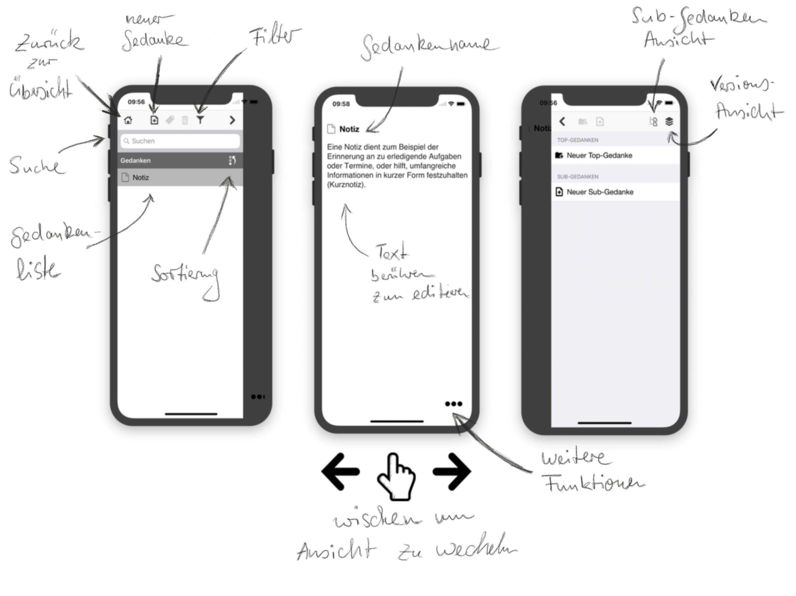
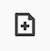
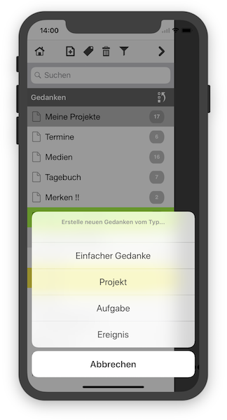
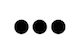
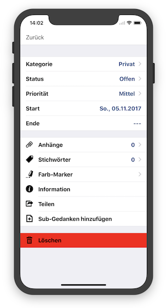
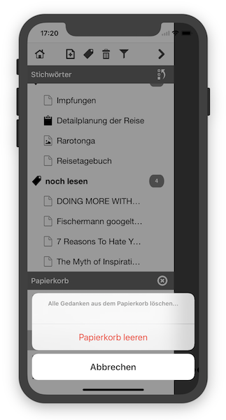
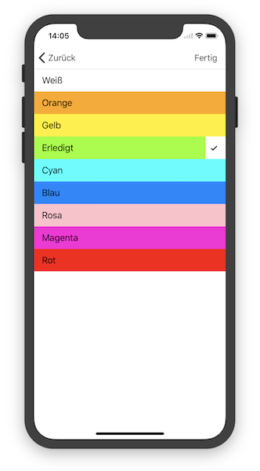
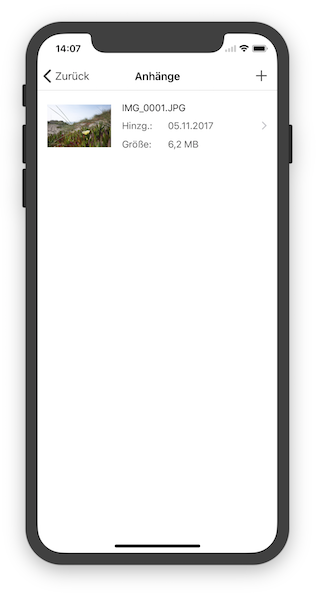
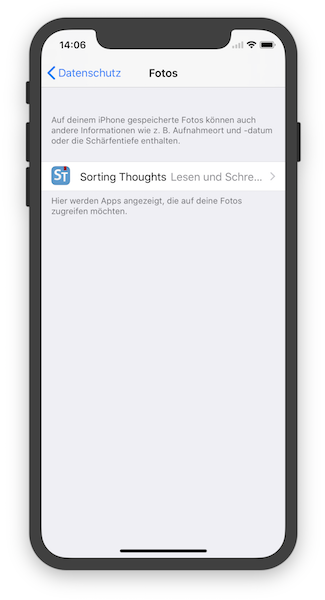

   [◀️ Gedanken-Bibliothek](gedanken_bibliothek.md)

  [Gedanken verwalten ▶️](gedanken_verwalten_mobile.md)

---------------
__Inhalt__
* TOC
{:toc}
---------------

## Grundlagen Mobile-Version

Die folgende Abbildung zeigt die Hauptelement von Sorting Thoughts für iOS:

Hier ist der Einfachheit halber die iPhone® Version abgebildet. In der iPad® Version sind einige Elemente anders platziert, ansonsten verhält sich die iPad® Version aber genauso.

---------------

**Hinweis:** Um alle hier beschriebenen Funktionen benutzen zu können, benötigen Sie mindestens das **Max Pack** oder ein **Sync-Service Abo**.

---------------

### Gedanke anlegen

Über folgendes Symbol können Gedanken erstellt werden:

Es können, wie auch in der Desktop Version, vier unterschiedliche Gedanken Typen erstellt werden:

* Einfache Gedanken
* Projekte
* Aufgaben
* Ereignisse

### Gedanke bearbeiten

Gedanken haben einen Ansichts- und Bearbeitungsmodus. Um in den Bearbeitungsmodus zu wechseln, einfach auf den Gedankennamen oder Gedankeninhalt drücken. Wenn der Inhalt bearbeitet wird, wird der Title des Gedanken auf dem iPhone® ausgeblendet. Gespeichert wird der Gedanke immer automatisch, wenn die Tastatur wieder ausgeblendet wird. Metadaten von Projekten, Aufgaben und Ereignisse können über den **Dreipunkte-Aktionsknopf**  :

rechts unten (iPhone®) bzw. rechts oben (iPad®) bearbeitet werden. Über den **Dreipunkte-Aktionsknopf** können noch einige weitere wichtige Funktionen für den aktuellen Gedanken erreicht werden.

### Gedanke drucken oder per Mail versenden

Über den Dreipunkte-Aktionsknopf erreicht man die Teilen Funktion und kann dann den Gedanken drucken bzw. per Email versenden.

### Gedanke löschen

Gedanken können direkt aus der Gedankenliste heraus über die nach links wischen Geste gelöscht werden oder über die Löschen Funktion aus der Dreipunkte-Funktionsauswahl. Gelöschte Gedanken werden zunächst in einen Papierkorb verschoben und können noch einmal wiederhergestellt werden. Der Papierkorb erscheint in der Gedankenliste und ist über das Mülltonnen Symbol erreichbar. Durch längeres Drücken auf den Title eines gelöschten Gedanken in der Gedankenliste kann dieser wiederhergestellt werden. Der Papierkorb kann über das X Symbol komplett geleert werden.

### Gedanke mit einer Farbe markieren

Gedanken können mit einer Farbe markiert werden, damit wird der Title in der Gedankenliste hervorhoben. Wie auch in der Desktop-Version können die Farbnamen geändert werden, dazu einfach länger auf die Farbzeile drücken und den Namen ändern:

### Gedanke umbenennen

Um den Namen umzubenennen, muss dieser einfach per Berührung ausgewählt werden. Nach dem Schliessen der Tastatur wird der Name gespeichert.

### Dateien anhängen

Es ist möglich Fotos an einen Gedanken anzuhängen. Dazu muss über den Dreipunkte-Funktionsknopf die Funktion **Anhänge** ausgewählt werden und dann über das Plussymbol ein bestehendes Foto aus der Galerie ausgewählt werden. Eine Beschreibung zum Anhang kann über langes gedrückt halten vergeben werden.

Wichtig ist das Sorting Thoughts die Erlaubnis hat Fotos aus der Galerie lesen zu dürfen. Falls Sie die Erlaubnis verweigert haben, können keine Fotos ausgewählt werden. Um die Erlaubnis nachträglich zuerteilen, muss man in den iOS Einstellungen unter Datenschutz Sorting Thoughts das Recht erteilen:

---------------

   [◀️ Gedanken-Bibliothek](gedanken_bibliothek.md)

  [Gedanken verwalten ▶️](gedanken_verwalten_mobile.md)

