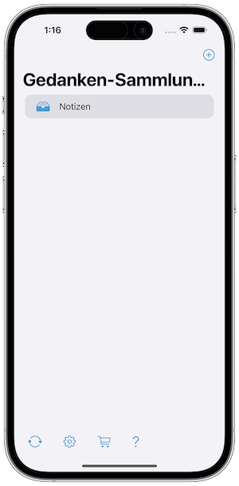
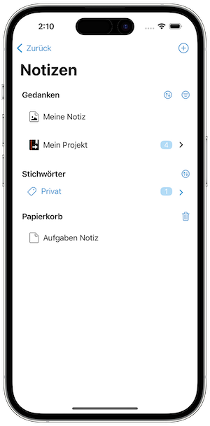
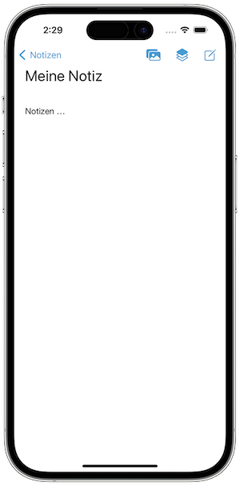
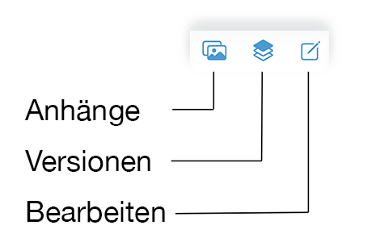
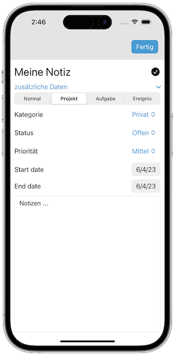
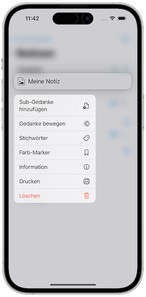
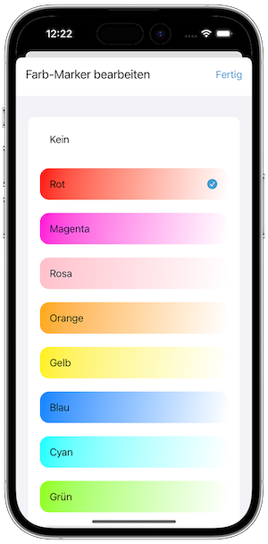

   [◀️ Gedanken-Bibliothek](gedanken_bibliothek.md)

  [Gedanken verwalten ▶️](gedanken_verwalten_mobile.md)

---------------
__Inhalt__
* TOC
{:toc}
---------------

## Grundlagen Mobile-Version

Die folgende drei Abbildungen zeigen die Hauptelement von Sorting Thoughts für iOS.

Der erste Screenshot zeigt den Startbildschirm. Hier kann eine neue Gedanken-Sammlung erstellt oder eine vorhandene öffnet werden. Außerdem können die Synchronisation, Einstellungen, den In-App-Store oder die Support-Ansicht geöffnet werden.

Der zweite Screenshot zeigt die ausgewählte Gedanken-Sammlung. Hier können Gedanken erstellt, bearbeitet, gelöscht, verschoben und gesucht werden. Außerdem können die Gedanken nach verschiedenen Kriterien sortiert und gefiltert werden.

Der dritte Screenshot zeigt die Inhalt des ausgewählten Gedanken. Hier kann der Gedanke bearbeitet werden. Es können Anhänge hinzugefügt und alte Versionen angezeigt werden.

Hier ist der Einfachheit halber die iPhone® Version abgebildet. In der iPad® Version sind einige Elemente anders platziert, ansonsten verhält sich die iPad® Version aber genauso.

---------------

**Hinweis:** Um alle hier beschriebenen Funktionen benutzen zu können, benötigen Sie mindestens das **Max Pack** oder ein **Sync-Service Abo**.

---------------

### Gedanke anlegen

Über folgendes Symbol können Gedanken erstellt werden:

Es können, wie auch in der Desktop Version, vier unterschiedliche Gedanken Typen erstellt werden:

* Einfache / normale Gedanken
* Projekt
* Aufgabe
* Ereignis

Es kann einfach zwischen den verschiedenen Typen gewechselt werden. Die Typauswahl kann direkt in der Bearbeitungsansicht vorgenommen werden.

### Gedanke bearbeiten

Gedanken haben einen Ansichts- und Bearbeitungsmodus. Um in den Bearbeitungsmodus zu wechseln, einfach auf den Gedankeninhalt drücken oder den Editier-Knopf drücken. Im Bearbeitungsmodus kann der Gedanke bearbeitet werden. Um den Bearbeitungsmodus zu verlassen, einfach auf den Fertig-Knopf drücken. Spezielle Gedanken Typen haben zusätzliche Felder die bearbeitet werden können.

In der Gedankenlistenansicht können Sie durch Verwendung einer Force-Touch-Geste auf den Gedanken weitere Bearbeitungsfunktionen erreichen. Dadurch wird ein Kontextmenü mit den folgenden Funktionen geöffnet:

### Gedanke drucken oder per Mail versenden

Das Gedanken-Kontextmenü enthält auch die Druckfunktion. Die Druckfunktion druckt den Gedanken aus und ermöglicht auch via iOS-Teilendialog den Gedanken per E-Mail oder an andere Apps zu senden.

### Gedanke löschen

Das Gedanken-Kontextmenü enthält auch die Funktion zum Löschen eines oder aller Sub-Gedanken. Gelöschte Gedanken werden in den Papierkorb verschoben. Der Papierkorb kann über das Mülltonnen Symbol in der Gedankenliste geleert werden. Jeder Gedanke im Papierkorb kann über die Wiederherstellen Funktion in der Gedanken-Ansicht wiederhergestellt werden.

### Gedanke mit einer Farbe markieren

Gedanken können mit einer Farbe markiert werden, damit wird der Title in der Gedankenliste hervorhoben. Wie auch in der Desktop-Version können die Farbnamen geändert werden, dazu einfach länger auf die Farbzeile drücken und den Namen ändern:

### Gedanke umbenennen

Um den Namen umzubenennen, muss dieser einfach per Berührung ausgewählt werden. Nach dem Schliessen der Tastatur wird der Name gespeichert.

### Dateien anhängen

Es ist möglich Fotos an einen Gedanken anzuhängen. Dazu muss über den Dreipunkte-Funktionsknopf die Funktion **Anhänge** ausgewählt werden und dann über das Plussymbol ein bestehendes Foto aus der Galerie ausgewählt werden. Eine Beschreibung zum Anhang kann über langes gedrückt halten vergeben werden.

Wichtig ist das Sorting Thoughts die Erlaubnis hat Fotos aus der Galerie lesen zu dürfen. Falls Sie die Erlaubnis verweigert haben, können keine Fotos ausgewählt werden. Um die Erlaubnis nachträglich zuerteilen, muss man in den iOS Einstellungen unter Datenschutz Sorting Thoughts das Recht erteilen:

---------------

   [◀️ Gedanken-Bibliothek](gedanken_bibliothek.md)

  [Gedanken verwalten ▶️](gedanken_verwalten_mobile.md)

