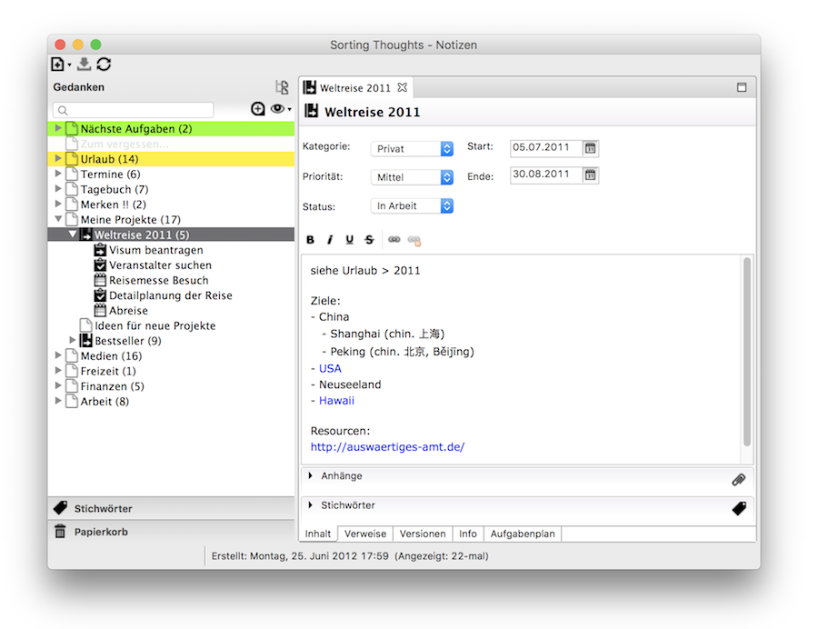
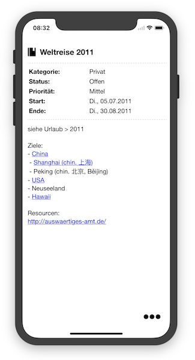
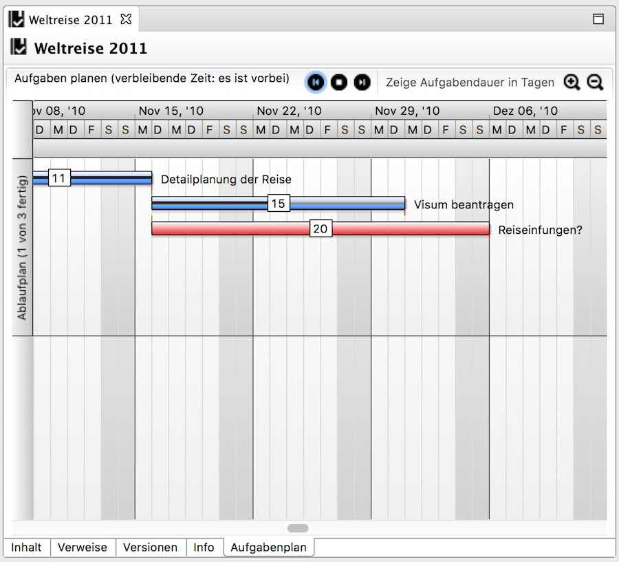
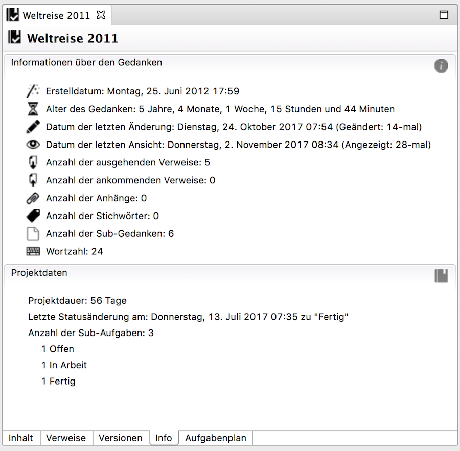
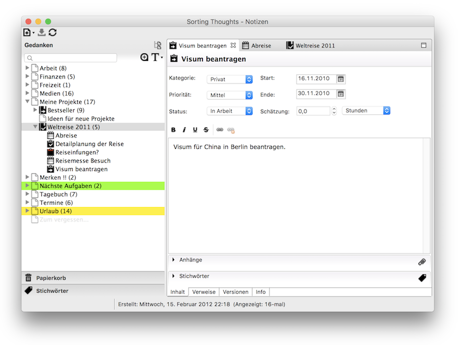
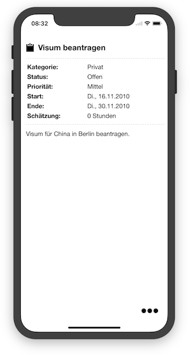
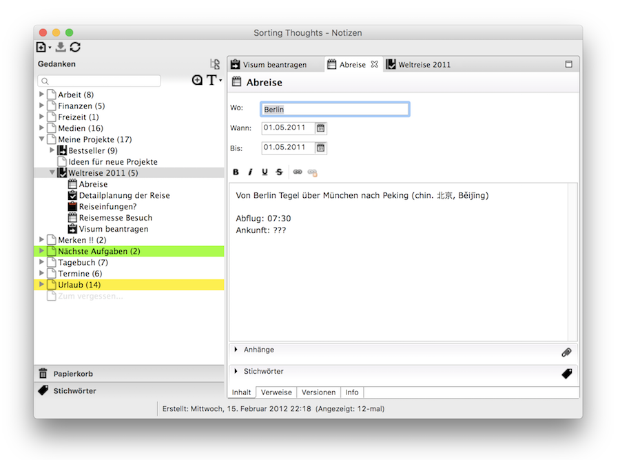
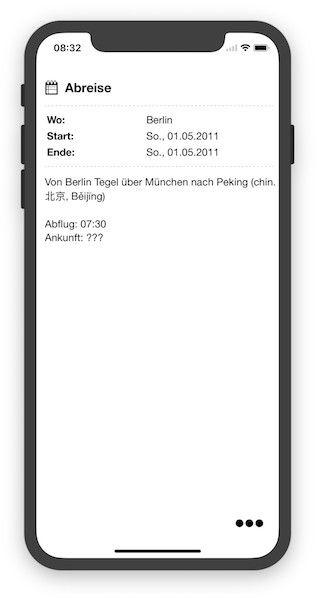
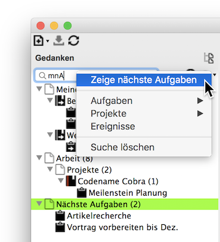

   [◀️ Gedanken verwalten](gedanken_verwalten.md)

  [Sync Service ▶️](../sync_service.md)

---------------
__Inhalt__
* TOC
{:toc}
---------------

## Projekt- und Aufgabenmanagement

Neben einfachen Gedanken ist es auch möglich Projekte, Aufgaben und Ereignisse mit Sorting Thoughts anzulegen und zu verwalten. Diese speziellen Gedanken haben zusätzliche Eingabefelder und Metadaten.

### Projekte

Jeder Projekt-Gedanke in der Desktop Version hat eine Aufgabenplan-Ansicht, die alle Unteraufgaben des Projektes in einem Gantt Diagramm visualisiert. Es ist auch möglich in den Gantt Diagramm die Aufgaben zu planen, indem sie zeitlich verschoben werden können. Per Doppelklick auf einen Aufgabenbalken kann man direkt die Aufgaben öffnen.

Die Metadaten eines Projekt-Gedanken haben eine extra Sektion, die darüber Aufschluss gibt wie lange das Projekt in welchen Status war und wie viele untergeordnete Aufgaben das Projekt hat.

### Aufgaben

### Ereignisse

### Zusätzliche Suchfilter

Es gibt in Sorting Thoughts zusätzlich Suchfilter, die das Auffinden von Aufgaben und Projekte vereinfachen. So können z.B. die nächsten fälligen Aufgaben angezeigt werden oder alle Projekte aus der Kategorie **Büro**.

Per Rechtsklick auf das Sucheingabefeld können folgende Filter erreicht werden:

Siehe auch [Suchen und Filtern](./gedanken_verwalten_desktop.html#filter)
