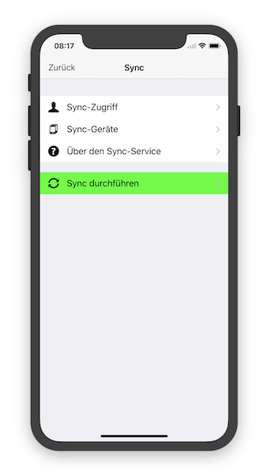

   [◀️ Projekte / Aufgaben](./handbuch/projekte_und_aufgaben.md)

  [FAQ ▶️](fragen_und_antworten.md)

---------------
__Inhalt__
* TOC
{:toc}
---------------

## Sync Service

Der ST Sync Service ermöglicht das Synchronisieren von Gedanken zwischen iOS und macOS bzw. MS Windows Geräten. So bleiben die Gedanken-Sammlungen auf allen Geräten synchron und ermöglichen ein geräteübergreifendes Arbeiten.

Der Service wurde nach dem 'Privatsphäre zuerst' Prinzip entwickelt, d.h. es werden keine persönlichen Daten für den Service benötigt und der Austausch erfolgt komplett Ende-zu-Ende verschlüsselt. Außerdem ist nur der Geräteinhaber in der Lage, die empfangenen Daten zu entschlüsseln, da nur er im Besitz des privaten Schlüssels ist. Die synchronisierten Daten werden zudem nach dem erfolgreichen Sync oder falls das Empfängergerät die Sync-Daten nach 30 Tagen nicht abgeholt hat vom Server gelöscht.

Server-Standort ist Deutschland und europäische sowohl deutsche Datenschutzrichtlinien werden von dem Service voll erfüllt.

**Privat**

Keine persönlichen Daten erforderlich, kein Benutzer-Tracking, vollständiges Löschen der eigenen Service-Daten jederzeit möglich. Es ist nur ein Sync Service und enthält kein Cloud Backup - voll Kontrolle über seine Daten.

**Sicher**

Volle Ende-zu-Ende Verschlüsselung mit standardisierten Technologien wie RSA, AES, TLS/SSL

**Unabhängig**

Hinter Sorting Thoughts steht kein großes Unternehmen oder Investoren, sondern ein einzelner unabhängiger Entwickler.

### Einrichten

#### 1. Schritt: Zugang erstellen
Um den Sync-Service nutzen zu können, wird zuerst ein Sync-Service Zugang benötigt. Den Zugang kann man mit einem Benutzernamen und Passwort in der Mobilen sowie in der Desktop Version erstellen.

**Sync-Service in den Einstellungen der Desktop Version**

**Sync-Service in den Einstellungen der Mobilen Version**

#### 2. Schritt: Abonnement auswählen

Als nächstes wird noch ein Sync-Service Abonnement benötigt, welches bei Abschluss mit dem Sync-Service Zugang verknüpft wird. Folgende Abonnements stehen zur Auswahl:

| Abonnement | Leistung | Preis  |
|:--------|:-------:|:-------:|
| Monats-Abo | Sync Service und alle Funktionen der iOS App von Sorting Thoughts für **1 Monat**. Dieses Abo ist ideal zum ausprobieren aller Sync-Funktionen. | 1,99 EUR|
| Jahres-Abo | Sync Service und alle Funktionen der iOS App von Sorting Thoughts für **1 Jahr**. Spare 37% gegenüber dem Monatsabo. | 14,99 EUR |

*Das Abo wird nicht automatisch erneuert und endet nach einem Monat bzw. nach einem Jahr.*

Ein Sync-Service Abonnement kann direkt aus der iOS Version von Sorting Thoughts heraus abgeschlossen werden oder über den Kauf eines Registrierungscodes auf der [Sorting Thoughts Homepage](https://www.sortingthoughts.de/blog/de/buy-sorting-thoughts/).

#### 3. Schritt: Weitere Geräte mit dem Zugang verbinden

Der Sync-Service macht natürlich nur Sinn, wenn man Sorting Thoughts auf mehreren Geräten benutzt. Nach Schritt eins und zwei können nun weitere Geräte mit dem Sync-Service verknüpft werden.

Technisch gesehen wird bei jeder Verknüpfung ein privater und öffentlicher Schlüssel erstellt, die für die Verschlüsselung der zu synchronisierenden Daten benötigt wird. Der private Schlüssel wird auf dem Gerät gespeichert und verlässt dieses Geräte nicht, d.h. nur das Gerät das über den privaten Schlüssel verfügt kann die empfangenden Sync Daten entschlüsseln. Der öffentliche Schlüssel wird an den Sync-Service gesendet damit andere Geräte Sync-Daten für das Geräte verschlüsseln können - dies wird  [Ende-zu-Ende Verschlüsselung](https://de.wikipedia.org/wiki/Ende-zu-Ende-Verschlüsselung) (E2EE) genannt.

### Sync durchführen

### Hinweise

Zugang löschen

Support ID

Datenvolumen beim Sync

---------------

   [◀️ Projekte / Aufgaben](./handbuch/projekte_und_aufgaben.md)

  [FAQ ▶️](fragen_und_antworten.md)

