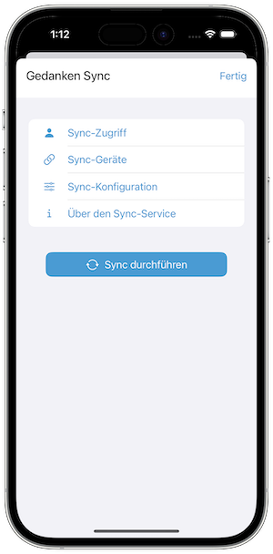

   [◀️ Projekte / Aufgaben](./handbuch/projekte_und_aufgaben.md)

  [FAQ ▶️](fragen_und_antworten.md)

---------------
__Inhalt__
* TOC
{:toc}
---------------

## Sync Service

Der ST Sync Service ermöglicht das Synchronisieren von Gedanken zwischen iOS und macOS bzw. MS Windows Geräten. So bleiben die Gedanken-Sammlungen auf allen Geräten synchron und ermöglichen ein geräteübergreifendes Arbeiten.

Der Service wurde nach dem 'Privatsphäre zuerst' Prinzip entwickelt, d.h. es werden keine persönlichen Daten für den Service benötigt und der Austausch erfolgt komplett Ende-zu-Ende verschlüsselt. Außerdem ist nur der Geräteinhaber in der Lage, die empfangenen Daten zu entschlüsseln, da nur er im Besitz des privaten Schlüssels ist. Die synchronisierten Daten werden zudem nach dem erfolgreichen Sync oder falls das Empfängergerät die Sync-Daten nach 30 Tagen nicht abgeholt hat vom Server gelöscht.

Server-Standort ist Deutschland und europäische sowohl deutsche Datenschutzrichtlinien werden von dem Service voll erfüllt.

**Privat**

Keine persönlichen Daten erforderlich, kein Benutzer-Tracking, vollständiges Löschen der eigenen Service-Daten jederzeit möglich. Es ist nur ein Sync Service und enthält kein Cloud Backup - voll Kontrolle über seine Daten.

**Sicher**

Volle Ende-zu-Ende Verschlüsselung mit standardisierten Technologien wie RSA, AES, TLS/SSL

**Unabhängig**

Hinter Sorting Thoughts steht kein großes Unternehmen oder Investoren, sondern ein einzelner unabhängiger Entwickler.

### Einrichten

#### 1. Schritt: Zugang erstellen
Um den Sync-Service nutzen zu können, wird zuerst ein Sync-Service Zugang benötigt. Den Zugang kann man mit einem Benutzernamen und Passwort in der Mobilen sowie in der Desktop Version erstellen.

**Sync-Service in den Einstellungen der Desktop Version**

**Sync-Service in den Einstellungen der Mobilen Version**

#### 2. Schritt: Abonnement auswählen

Als nächstes wird noch ein Sync-Service Abonnement benötigt, welches bei Abschluss mit dem Sync-Service Zugang verknüpft wird. Folgende Abonnements stehen zur Auswahl:

| Abonnement | Leistung | Preis  |
|:--------|:-------:|:-------:|
| Monats-Abo | Sync Service und alle Funktionen der iOS App von Sorting Thoughts für **1 Monat**. Dieses Abo ist ideal zum ausprobieren aller Sync-Funktionen. | 1,99 EUR|
| Jahres-Abo | Sync Service und alle Funktionen der iOS App von Sorting Thoughts für **1 Jahr**. | 14,99 EUR |

Wenn Sie ein automatisch erneuerbares Abonnement über den iOS App Store kaufen, können Sie den Sync-Service eine Woche lang kostenlos ausprobieren. Kunden, die bereits die Desktop-Version von Sorting Thoughts gekauft haben und ein aktives Sync-Service-Abonnement besitzen, können alle Funktionen der iOS-App kostenlos nutzen.

Ein Sync-Service Abonnement kann direkt aus der iOS Version von Sorting Thoughts heraus abgeschlossen werden oder über den Kauf eines Registrierungscodes auf der [Sorting Thoughts Homepage](https://www.sortingthoughts.de/blog/de/buy-sorting-thoughts/).

#### 3. Schritt: Weitere Geräte mit dem Zugang verbinden

Der Sync-Service macht natürlich nur Sinn, wenn man Sorting Thoughts auf mehreren Geräten benutzt. Nach Schritt eins und zwei sollten nun weitere Geräte mit dem Sync-Service verknüpft werden.

Um dies zu tun, muss der Sync-Service in den Einstellungen der Desktop-Version und/oder der mobilen Version aktiviert werden. Der Sync-Service wird aktiviert, indem der Benutzername und das Passwort des Sync-Service-Kontos eingegeben werden.

Technisch gesehen wird bei jeder Verknüpfung ein privater und öffentlicher Schlüssel erstellt, die für die Verschlüsselung der zu synchronisierenden Daten benötigt wird. Der private Schlüssel wird auf dem Gerät gespeichert und verlässt dieses Geräte nicht, d.h. nur das Gerät das über den privaten Schlüssel verfügt kann die empfangenden Sync Daten entschlüsseln. Der öffentliche Schlüssel wird an den Sync-Service gesendet damit andere Geräte Sync-Daten für das Geräte verschlüsseln können - dies wird  [Ende-zu-Ende Verschlüsselung](https://de.wikipedia.org/wiki/Ende-zu-Ende-Verschlüsselung) (E2EE) genannt.

#### 4. Schritt: Konfiguration der Synchronisation

Jetzt kann konfiguriert werden, welche Gedankensammlungen mit welchen Geräten synchronisiert werden sollen. Dies erfolgt in den Einstellungen jeder Installation. In der Desktop-Version werden die Einstellungen angezeigt, bevor Sie mit der Synchronisierung beginnen. In der mobilen Version können Sie die Synchronisierung in den Einstellungen des Sync-Services konfigurieren. 

Um eine Gedankensammlung zu synchronisieren, muss die Synchronisierung in den Sync-Einstellungen aktiviert sein und Sie müssen die Geräte auswählen, mit denen diese Gedankensammlung synchronisiert werden soll.

### Sync durchführen

Nach der Konfiguration kann der Sync manuell gestartet werden und wird nicht im Hintergrund verarbeitet. Es ist wichtig zu beachten, dass der Sync erst beendet sein muss, bevor weitere Änderungen vorgenommen werden können.

Wenn die Synchronisierung auf mehreren Geräten konfiguriert wurde, sollte immer mit der Synchronisierung auf dem Gerät begonnen werden, auf dem die meisten Änderungen vorgenommen wurden. Dadurch wird sichergestellt, dass die Synchronisierung so schnell wie möglich verarbeitet wird.

Wenn der Sync für eine Gedanken-Sammlungen deaktiviert wird und diese Gedanken-Sammlungen später wieder aktiviert wird, muss beachtet werden, dass alle Inhalte der Sammlung wieder erneut übertragen werden müssen. Nur wenn der Sync aktiv bleibt, werden ausschließlich die Änderungen übertragen.

### Wichtige Hinweise

**Zugang löschen**

Es ist jederzeit möglich seinen Zugang zu löschen, allerdings sollte man beachtet dann auch die Information über das Abonnement gelöscht werden und das Abonnement damit vorzeitig beendet wird. **Dies wird passieren, wenn Sie Ihren Zugang auf allen Geräten löschen und ein nicht erneuerndes Abonnement haben.**

**Support ID**

Für Support-Anfrage bezüglich des Sync-Services bitte die persönliche Support-ID (zu finden unter Einstellungen / Sync-Service / Zugang) mit angeben. Ansonsten ist es nicht möglich das zugehörige Benutzerkonto im Sync-Service zu identifizieren.

**Datenvolumen beim Sync**

Durch die Ende-zu-Ende Verschlüsselung müssen die Sync-Daten für jedes Zielgerät extra übertragen werden. Bei einem Sync der z.B. an drei Geräte gesendet wird verdreifacht sich dementsprechend die Übertragungsmenge.

---------------

   [◀️ Projekte / Aufgaben](./handbuch/projekte_und_aufgaben.md)

  [FAQ ▶️](fragen_und_antworten.md)

